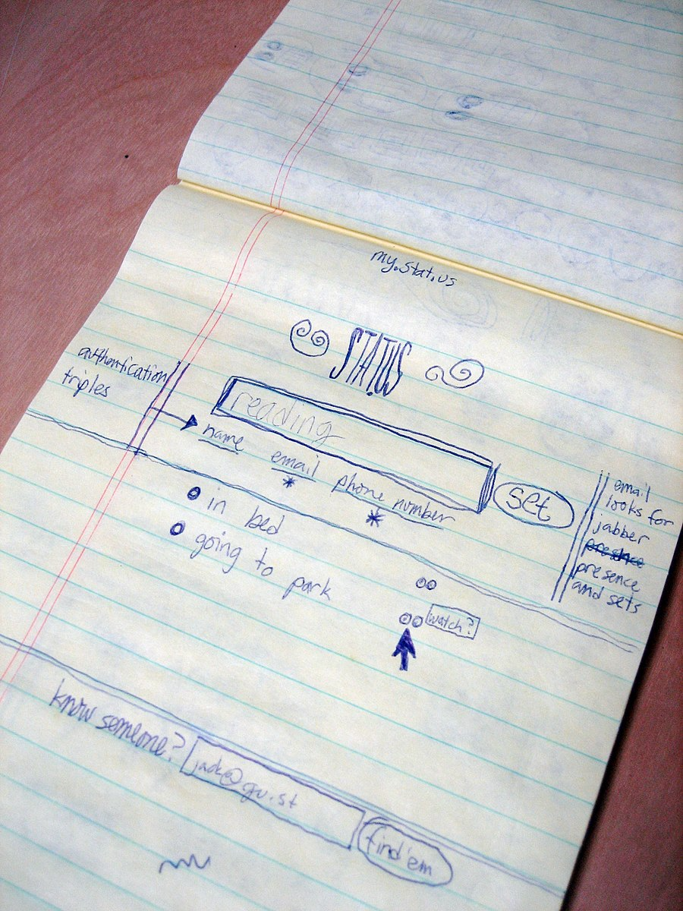
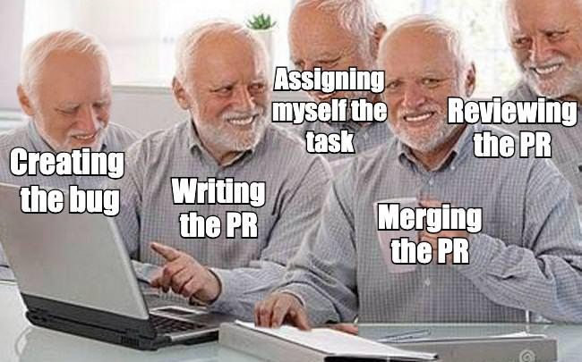

# Building Your Own Idea
## Building your own idea 💡
  - [Video](https://youtu.be/4uxzx9Pevcs)
  ```md
  Can you now identify a problem that can be solved with software and build something to test your theory?

  Remember, [the verb you want to be using with respect to ideas is not "think up" but "notice."](http://paulgraham.com/startupideas.html)

  The goal is for you to take a proof of concept — which is smaller than a minimum viable product — from a sketch all the way through deployment, and thereby witness firsthand at least one cycle of software development, and its constituent moving parts.

  That's a lot to do, so keep the functionality to a minimum — [Keep it simple 😽](#Keep it simple 😽).

  ## Requirements
  ### Hard requirements
  - It should solve a problem that you clearly articulate in a Functional Specification 📝.
  - It should be interactive in some way; in other words, it should not just be an informational, static website. (Adding a "Contact Us" form to the bottom of a landing page is not sufficient interactivity.)

  That's it. Due to the wide variety in the ideas that people come up with, those are the only hard requirements.

  ### Soft guidelines
  However, historically, the vast majority of final projects (like the vast majority of software that we use on a daily basis) have also fit the following pattern:

  - You can interact with it through your browser.
  - It uses a database to store information.
  - It has some associations (one-to-many and/or many-to-many) between tables.
  - It has sign-in/sign-out functionality to personalize the experience for each visitor.

  In other words, standard CRUD applications.

  In very rare cases, an idea might not need a database (perhaps it reads and stores all data using an external API) or it might not need sign-in/sign-out (perhaps you are the only user and it emails you a CSV every morning). If you have an idea like this, you should run it by me. If it's not static HTML and it solves a problem for you, I'll likely be happy with it.

  But, mostly, projects fit the pattern of standard CRUD applications; similar to the ones we've built together in class:
    - to-do lists
    - social networks
    - two-sided markets
    - etc.

  We have created a [Requests for Projects 🤝](https://rfp.dpi.dev) page to help closely align your project with industry trends and employer expectations. I highly encourage you to build a project that fits within these categories (or similar). If not, please chat with an instructor or assistant and we can work something out.

  ## Deliverables
  Ultimately, you will submit:

  - Screencast Demo Video 🎬
  - Functional Specification 📝
  - GitHub Repository URL 🔗 📦
  - Project URL 🌐
  - Showcase slides 🖼️
  ```

## Requests for Projects 🤝
```md
Please read through our [Requests for Projects](https://rfp.dpi.dev) page to get an idea for the types of projects we're looking for. I strongly encourage you to read through this document and think about projects that can make your portfolio stand out to potential employers.
```

## "Noticing" a Project Idea 🤔
  - **Points**: 2
  - **Submitting**: a website url
  - [Slides](https://github.com/DPI-WE/sdf-noticing-a-project-idea)
  - [Video](https://www.youtube.com/watch?v=4yPewZRnhaQ)
  ```md
  This lesson discusses how to think about project ideas

  **Assignment**: Please submit your proposal(s) including answers/scores/rankings to some of these key questions on a spreadsheet. We want to make sure you have at lest considered a few ideas before building anything. Don't hesitate to reach out for a 1on1 with an instructor, TA, or fellow trainee and talk through what you are thinking. [Here's a great example from last cohort](https://docs.google.com/spreadsheets/d/1jrgdMMt33lIGqXTEu8vE2fwLjoMkzyJAPlZuKLihvuQ/edit#gid=0).
  ```

## Pain Points 🥲
  - **Points**: 2
  - **Submitting**: a text entry box
  - [Slides](https://github.com/DPI-WE/sdf-pain-points)
  - [Video](https://youtu.be/3QbfM3xbT6U)
  ```md
  This lesson discusses pain points and the solutions built to address them.

  **Assignment**: What pain point do you plan to address? How do you plan to solve it? Is it a vitamin, pain killer, or cure?
  ```

## Keep it simple 😽
  - **Points**: 2
  - **Submitting**: a text entry box or a website url
  - [Slides](https://github.com/dpi-we/sdf-keep-it-simple)
  - [Video](https://youtu.be/2f451BQ6dqY)
  ```md
  This lesson talks about early versions of famous products and encourages you to keep it simple.

  **Assignment**: What's the smallest thing you can build right now that will allow you to test one assumption? Please submit a few essential user stories and the hypothesis you are testing.
  ```

## Sketches ✍️
  - **Points**: 2
  - **Submitting**: a text entry box, a website url, or a file upload
  ```md
  Once you have an idea in mind, reach for pen and paper and start sketching.

  ## Speedy Eights
  Try out [Speedy Eights](https://thoughtbot.com/product-design-sprint/guide/diverge/speedy-eights) to get some thoughts down on paper.

  One round, use the 8 panels to progress through the different screens of a flow.

  Another round, use the 8 panels to explore 8 different takes on the most important screen in the app.

  Remember, you are only supposed to spend around 40 seconds per panel! Actually set a timer and stick to it. Try [using a sharpie rather than a pen](https://signalvnoise.com/posts/1788-oldie-but-goodie-sketching-with-a-sharpie) to prevent yourself from getting into too much detail in this phase.

  ## Wireframe
  Then, select one flow you like, and draw out each screen in a bit more detail. Pen and paper is totally fine!

  Here is an early sketch of X (formerly Twitter) (formerly Twttr) circa 2006 for inspiration.

  

  **Assignment**: Please submit some sketches of your idea. Maybe a few different screens of a flow or different takes on the most important screen in the app. 
  ```

## User Stories 📖
  - **Points**: 2
  - **Submitting**: a text entry box or a website url
  ```md
  When I'm writing down a feature, I usually phrase it as a [User Story](http://www.romanpichler.com/blog/10-tips-writing-good-user-stories/). User stories are just features, phrased in a particular manner:

  > As a **role**, I want to be able to **capability**," (and, optionally), "so that **benefit**.

  The aim is to always be thinking from a user-centric perspective, and not from a technology or implementation perspective yet.

  First, brain-dump all the features you can possibly imagine as user stories.
  Then, re-order them by priority.
  Then, crucially, ask yourself: what is the absolute minimum feature-set I can get away with in this first experimental prototype? The prototype's purpose is just to validate whether or not the idea is feasible and whether the core value is actually valuable. Be ruthless in eliminating all non-essential user stories for this 1st draft.
  Move only the essential stories to a new list: this will be your proof-of-concept feature-set.
  These proof-of-concept features are what you should try to design a domain model for. Don't plan ahead for anything else — you'll just create extra work for yourself, for likely no return. Remember that we will most likely throw away our first proof of concept and re-write it with our learnings.

  **Assignment**: Please submit a few potential user stories for your idea. Remember to phrase them from the user perspective. "As a **role**, I want to be able to **capability**," (and, optionally), "so that **benefit**."
  ```

## Domain model 🤓
  ```md
  Before we begin writing code, we want to have our complete domain model in hand:

  - What tables and columns will you need? Try to produce a complete list of tables and columns.
    - all tables
    - all columns on each table
    - the datatype of each column
    - any validation rules we want on each column
    - all associations
      - join tables required for many-to-many associations
      - foreign keys required for one-to-many associations
  - I find it helpful to use paper or a Spreadsheet 📋 to actually draw out all my tables, columns, and try entering in rows to make sure I can record everything necessary for all screens and possible user actions that I can see in the mockup.
  - Then create an ERD (Entity Relationship Diagram) 🧑‍💻
  ```
    - Domain Model: Spreadsheet 📋
      - **Points**: 2
      - **Submitting**: a website url
      ```md
      Please submit a link to a Google Sheet of your domain model with a few rows of sample data.
      ```
    - Domain Model: ERD (Entity Relationship Diagram) 🧑‍💻
      ```md
      Please submit a screenshot of your entity relationship diagram (ERD) using the [first draft Entity Relationship Diagram (ERD) tool](https://ideas.firstdraft.com/)
      ```

## User Feedback 🗣️
  - **Points**: 2
  - **Submitting**: a text entry box
  - [Slides](https://github.com/heratyian/user-feedback)
  - [Video](https://youtu.be/WKOKIIo1fUQ)
  ```md
  This lesson goes over some techniques to talk to users effectively.
  
  **Assignment**: Who is your user? Can you develop a "persona" of your target user? What are some good questions you can ask them to understand what to build?
  ```

## Estimating and prioritizing work 🤔
  - **Points**: 2
  - **Submitting**: a text entry box or a website url
  - [Slides](https://github.com/DPI-WE/sdf-estimating-and-prioritizing/)
  - [Video](https://youtu.be/isHiBj5gAwc)
  ```md
  This lesson explores techniques to estimate and prioritize work.

  **Assignment**: Please estimate and prioritize a few user stories. This can be in a [GitHub project](https://docs.github.com/en/issues/planning-and-tracking-with-projects/creating-projects/creating-a-project) or in your notes. I'm looking for an estimate on effort/impact.

  > As a **role**, I want to be able to **capability**," (and, optionally), "so that **benefit**.
  >   - (estimated impact)
  >   - (estimated effort)

  eg. 

  As a user, I want to register for an account to create and manage my calendars.
    - high impact
    - low effort
  ```

## Functional Specification 📝
  - **Points**: 2
  - **Submitting**: a website url
  - [Video](https://youtu.be/twc8BAyKuWE)
  ```md
  Make sure you have already identified a Pain Point 🥲, Submitted Project Ideas 🤔, written User Stories 📖, Sketches ✍️ and Created a domain model 🤓.

  A functional specification is a document that specifies the functions that a system or component must perform.

  A functional specification does not define the inner workings or a specific technology stack.

  What I'm looking for is a name, 1-liner, pain point you are solving for, user stories, a domain model, a hypothesis you are testing, a target user persona, and maybe some sketches.

  This will be your "north star" while building your project. You will use this to verify you are accomplishing what you set out to at the start. You should be able to hand this document to someone after you launch (think a quality assurance tester) and they could verify you are doing everything required.

  Examples:

    - [Calendar Feed](https://gist.github.com/heratyian/9a054d6b45b03739b32efa014872915e)
    - [Pensieve](https://gist.github.com/thierrychau/0d558373c7605ed4459f21a80ea86112)
    - [LessonLinx](https://gist.github.com/fidel-techprep/0be1f75266254b67a661e6e1610b932f)
    - [Belay Board](https://gist.github.com/Samuel-Lubliner/e85279702dfcb2381354a963ac97fdc3)
    - [The Prettiest Price](https://gist.github.com/ajmompr/39aa2ae025fa441f1a970417671eef0f)
    - [Gym Tracker](https://gist.github.com/hibbleD/53a8aca25a5462aa7750fcb649e25c74)

  **Assignment**: Please submit a functional specification using a [GitHub Gist](https://gist.github.com/).
  ```

We strongly suggest you get approval from an instructor for your project idea before building anything.

## Getting started 🎬
  - **Points**: 2
  - **Submitting**: a website url
  ```md
  Before getting started, make sure you have already identified a Pain Point 🥲 written User Stories 📖, Created a domain model 🤓 and put this all together in a Functional Specification 📝.

  Start with a blank Rails application by [generating a repository based on our rails-7-template](https://github.com/new?template_name=rails-7-template&template_owner=appdev-projects).

  Enter `bin/dev` in terminal to start your web server after the setup completes.

  **A**lways **B**e **C**ommitting.

  I encourage you to use an Industrial Git Flow (feature branches with pull requests) even though you will likely be the only developer on this project.

  

  Feel free to tag an instructor, teaching assistant or classmate to review a pull request.

  Remember to Keep it simple 😽

  Please watch this video on [How to Build An MVP](https://www.youtube.com/watch?v=QRZ_l7cVzzU)

  **Assignment**: Please submit your GitHub Repository URL
  ```

## Launch 🚀
  - **Points**: 2
  - **Submitting**: a website url
  - [Video](https://youtu.be/rSwtMEx5h-I)
  ```md
  Launch as soon as you can so you can start collecting real data and test your hypothesis.

  Launch with Render
    - [Learn](https://learn.firstdraft.com/lessons/114-deploying-to-render)
    - [GitHub](https://github.com/appdev-lessons/deploying-to-render)

  Another helpful [gist](https://gist.github.com/heratyian/706d70d1e5aee64f2dd40ea0664f730e)

  **Assignment**: Please submit your URL once you launch. You may want to purchase a Domain Name 🌐.
  ```

## How to get your first 5 users (and convert them to customers) 5️⃣📲🥳
  - **Points**: 2
  - **Submitting**: a text entry box or a file upload
  - [Slides](https://github.com/DPI-WE/how-to-get-your-first-5-users-customers)
  - [Video](https://youtu.be/ytcySD0wFOQ)
  ```md
  **Assignment**: Please write a script for your app following the ACA (acknowledge compliment ask) framework. Reach out to someone in your network and share a screenshot, chat log, or summary of your conversation. 

  (You don't have to wait until after launch! You can add them to a waiting list 😉)
  ```
