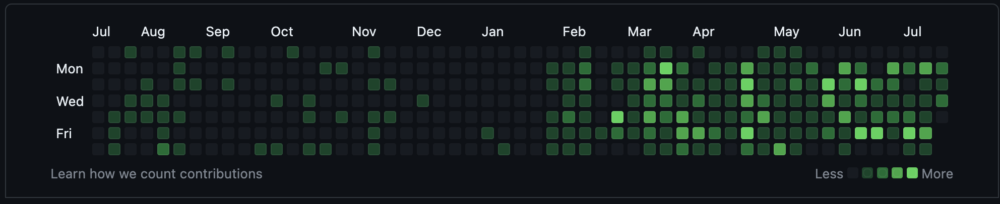
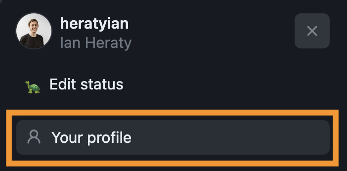
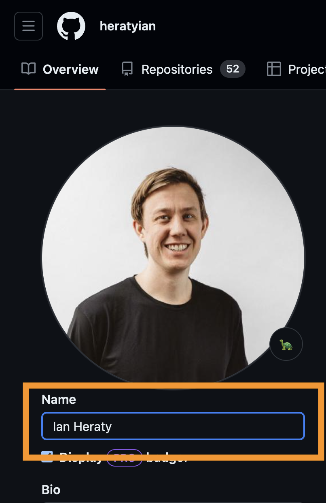
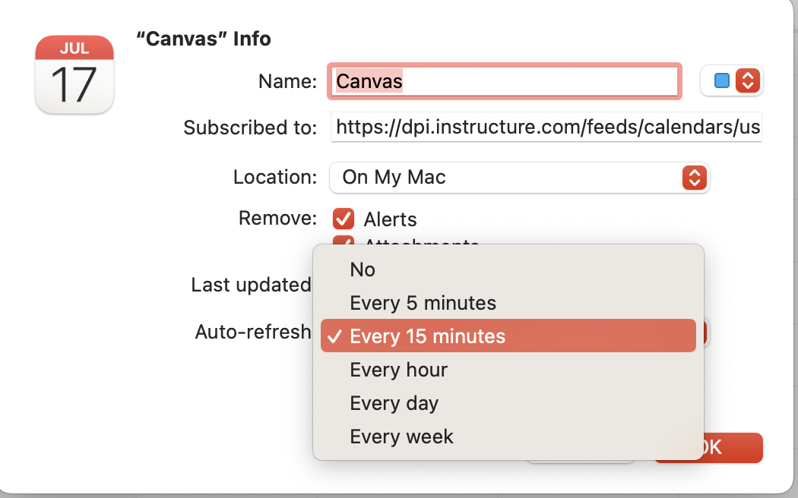
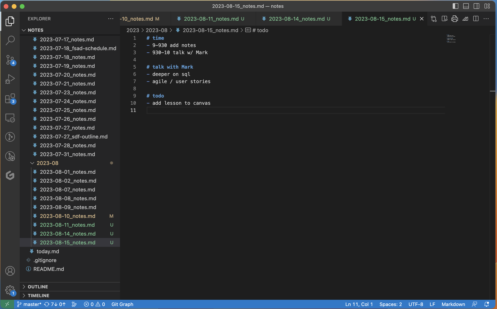

# Getting Started
- Welcome!
- Join Discord chat 💬
```md
Join the Discord server to chat with your classmates and instructors. (link on home page)

Discord Server Rules

1. Be kind
2. Use the same name (first and last) used in canvas in your server profile
3. Use a workplace appropriate profile image
```

- GitHub 😸
```md
Please sign up for [GitHub](https://github.com/join) and share your profile page. It should be something like this `github.com/<username>`. Please set a profile image and display name using your first and last name so it's easy to tag you. Your GitHub profile is like a software engineering resume. It's important for employers, clients, teammates, etc. to know it's you. I also recommend keeping only 1 GitHub account so your contribution graph is full of green. You can create organizations to separate your repositories. 



This is mine. https://github.com/heratyian

Here are the steps to update your 'display name':






```

- TIL Blog 📝
```md
Keeping a learning journal is extremely valuable for software developers, for many reasons:

- Writing about what you’re doing helps clarify and internalize it.
- The post serves as documentation for the code, for teammates and your future self.
- When you inevitably have to do the same task again six months or two years later, you’ve written a cheat sheet for yourself.
- It looks great to prospective employers, demonstrating both writing and technical ability, among other things.

We call these "TIL blogs" or "TILs" — short for "Today I Learned". It isn't meant to be a blog where you're publishing brand new ideas that no one has ever thought of before — instead, they're just notes to your future self. (But I do learn about a lot of new stuff by reading students' TIL blogs, even after all these years.)

Here is [a learning journal](https://jelani.dev/) from a past student who went on to become an instructor himself, as a great example.

We're going to use [dev.to](https://dev.to/) for our blogs, for now. (In the future you can consider building your own blog — that would be a good exercise.)

[Sign up for a dev.to account](https://dev.to/enter) — I recommend signing in with GitHub so that you don't have to make up yet another password.

**Submit the URL of your learning journal**. It will look something like `https://dev.to/demostudent18`

Start jotting down notes in your blog. You can save posts as drafts if you're not ready to share them yet.

A great source of TIL blog posts are answers to questions you've asked and other discussions (your own or others). To really cement what you learned, re-write the answer to your question or discussion as a TIL post.

Keep track of everyone's TIL blogs on [news.dpi.dev](https://news.dpi.dev/). Someone else might have already written the answer to your question!
```

- Learn: create an account ✏️
```md
We will be using a platform called Learn to host project notes, embedded quizzes, and to launch GitHub projects.

Visit https://learn.firstdraft.com/users/sign_up to sign up for an account before proceeding.

You can use whichever email address you prefer for the sign up step.


This will bring you to an empty "Lessons" page, which will begin to populate as you move through the course.


In the future, to get back the list of lessons you've begun, click on the "firstdraft" logo at the top of a Lesson page:


You can close this browser tab when you've completed the sign up.
```

- Setup your email 📧
```md
Please setup an email client with your account. I use the built in email client on macOS. It is very important to mind your email on the job. When you use an email client it's much easier to monitor incoming emails. (especially if you have multiple accounts)


Please submit the name of the email client you will be using in class.
```

- Setup your calendar 📅
```md
Canvas has a really neat feature: the Calendar.

It will aggregate events, assignments, etc, from all of the courses you are enrolled in:


It also provides a calendar feed URL, which you can subscribe to in your calendar of choice (I use apple calendar):


Option A (Outlook):


Option B (Apple):


We will be using this feature for scheduling lectures and assignments. Make sure to set the calendar subscription to auto-refresh at least every 15-minutes so you always have an accurate calendar. 



Employees are expected to monitor their calendar. This is a good opportunity to practice using your calendar, whether it's Apple Calendar, Google Calendar, Outlook or any other.

Please subscribe to the canvas calendar feed and submit the name of your preferred calendar app.

**Enter the name of your calendar application you're using to subscribe to the canvas calendar.**
```

- Log in to DPI Dashboard 🌐
```md
Please go to https://dashboard.dpi.dev

If this is the first time you are logging in, select the **forgot my password link**, enter your Canvas email, and look for an email verification and sign-in link to set a new password for the dashboard. Check your spam folder for the email if you do not find it in your Inbox.

In the dashboard: update your profile, and **submit your snapshot url**. Make sure to check out your snapshot and edit your profile so it has updated information. We share these snapshots with employers so make sure it is a good reflection of your skills and experience.

Here are some examples from previous cohorts:


```

- Daily Stand-ups 🌟
```md
Daily "stand-ups" are a very common practice on "agile" development teams.
A quick meeting — 10 minutes or less — for the entire team to check in with each other. It's called "stand-up" because it's supposed to be short enough to stand for the entire thing.
You go in a circle and briefly describe three things:
1) what did you work on yesterday?
2) what are you working on today?
3) is anything blocking you?
You may also "pass" if what you did is completely irrelevant to the team (e.g. I took my dog to the vet).
The key part is #3 — to find ways to get unblocked. It may be finding people with expertise in what you're struggling with or letting other people know that they're blocking you.
It might feel a little scary to share what you're working on. Maybe you're behind and feel self-conscious? Maybe you're ahead and feel self-conscious?
It's natural and understandable, but we need to overcome this reflex.
We're all on a team together, and on a healthy team, people are transparent with each other. There's no judgment, only support.
Less than 1 minute per person.
What did you work on yesterday?
It's okay to say "I pass" if e.g. you were at a doctor's appt or worked on something not relevant to the team.
What are you planning to work on today?
Try to be specific; not just "Ruby stuff yesterday, more Ruby stuff today". Otherwise you might as well just pass.
Any blockers or "Aha!" moments?
It's okay to say "No blockers". Since we're mostly learning and not yet working on teams, you probably won't have blockers, per se. 
However, instead: try to think of any "Aha!" moments that you had yesterday and share those.
We'll be doing stand-ups every day at 9:15

Remember to spend some time preparing for stand ups by writing down your 3 things.
```
  - Daily Stand-ups 🌟
  ```md
  What are you supposed to do during stand-ups?
  ```

- Create a Workspace folder 👷
```md
It's a best practice to keep 1 workspace folder for all of your code. Let's set that up now.

1. Open a terminal on your computer. Enter ⌘+spacebar to open spotlight and type in terminal.


2. Enter `pwd` command to print the working directory. It should look something like this.

`% pwd`

/Users/ianheraty
3. Enter `mkdir Workspace` command to make a `Workspace` directory.


% pwd

/Users/ianheraty

% mkdir Workspace


4. Enter `ls` command to list the contents of your directory and verify you have created the Workspace directory.

% ls             

Applications Downloads Music Workspace

Desktop Library Pictures tmp

Documents Movies Public

5. Enter `open .` command to open the current directory in finder.

`% open .`

6. Drag `Workspace` folder to your favorites for easy access.


Please submit a screenshot showing this new folder.
```

- Taking notes 📝
```md
Please create a `notes` folder inside your `Workspace`.


I like to create a [markdown](https://www.markdownguide.org/) file every morning for all my notes. I usually track how I spend my time, meeting notes, links, and things I need to do that day. I encourage you to install [Visual Studio Code](https://code.visualstudio.com/) on your laptop for writing notes.



If you want to go a step further, make your notes folder a git repository. That way you can push commits to a GitHub repository and share notes between multiple devices.

Please submit a screenshot showing this notes folder with a markdown file for todays notes.
```

- Scratch folder 😼
```md
Please create a `scratch` folder inside your `Workspace`.


This is a place to experiment and create one off scripts and files. 


Please submit a screenshot showing this folder.
```

- Ask: create an account 🙋
```md
Visit this link and sign up for an account at ask.firstdraft.com.

Ask lots of questions! And experiment with requesting responses from the GP-TA.

Please submit your Ask username and email so we can add you to the 2023-9.1 SDF forum.
```
- Asking Questions ❓
```md
## Questions ❓
- This course is question-driven.
- We need you to ask questions.
- Speak up whenever you feel like it, raise your hand in the classroom, post a question to Discord or [ask.firstdraft.com](http://ask.firstdraft.com/).
- If you’re not sure whether it’s relevant to everyone, message a TA or Instructor and ask them; they’ll decide and escalate.
- our rule: **You’re only allowed to get stuck for 15 minutes before asking a question.**
- Post your questions on Discord or ask.firstdraft.comLinks to an external site.
- The course is organized according to the the 🔐 lock-before-key principle; until someone asks the question, I won’t provide the info needed to solve an exercise.
- Most of your programming work will be done at your own pace
- Learning occurs through asking questions
- Remember the 15 Minute Rule
- You’re only allowed to get stuck for 15 minutes before you ask a question.
- Don’t spin your wheels for longer than that!
- When you have a question, instead of raising your hand or finding one of us, we want you to first type up your question on [ask.firstdraft.com](http://ask.firstdraft.com/) or Discord.

## Why? 🤨
- Writing out what you’re struggling with will often help you solve it yourself
- Writing well is an essential component of succeeding as a software engineer (remote work, stack overflow, GitHub etc.)

## Asking Questions 🙋
- State the problem you’re working on
- What is your code doing right now?
- What do you want it to be doing instead?
- Copy-paste the snippet(s) of code that you think are relevant.
- Describe what you’ve tried so far to resolve.

## Code Snippets 👨‍💻
Please use [markdown code snippets](https://www.freecodecamp.org/news/how-to-format-code-in-markdown/) when sharing pieces of code

`<h1>Hello, world!</h1>`

## Answering Questions 🤓
- Keep an eye on [ask.firstdraft.com](http://ask.firstdraft.com/) and try to help your classmates
- After you solve your problem, please update your question with the answer

## Participation 🏆
- "Ask participation" is a component of your overall evaluation/”grade”
- We keep track of:
  1. Number of questions you’ve asked (this is the most important metric)
  2. Number of other peoples’ questions you’ve read (2nd most important metric)
  3. Number of other peoples’ questions you’ve answered

## In Review 📜
- Even though it’s weird to be asking & answering questions on a forum, please give it a try.
- Trust us, it greatly improves learning and retention to write first and then talk it through.

## Still not convinced?
- [Steve Jobs on 'asking for help'](https://www.youtube.com/watch?v=zkTf0LmDqKI)
```

- Asking Questions: Framework 🤔 🙋‍♂️🙋‍♀️
```md
What is the 5-step framework for asking good questions?
```

- Asking Questions: Code Snippets 🧑‍💻
```md
- What are code snippets?
- How do they work?  
- Please provide an example of a markdown code snippet.
```
