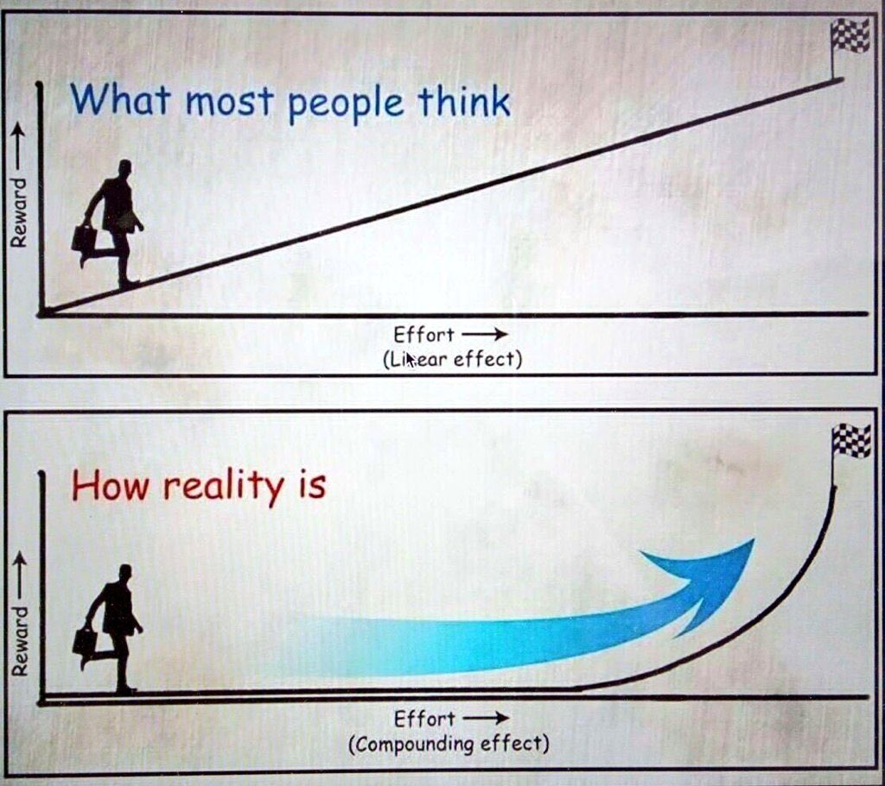

# Software Development Foundations (we-2024-2-1-sdf)

## Modules
- [Getting Started](./getting-started.md)
- [Technical Setup References](./technical-setup-references.md)
- [Sprint 1 Assignments](./sprint-1-assignments.md)
- [Sprint 2 Assignments](./sprint-2-assignments.md)
- [Sprint 3 Assignments](./sprint-3-assignments.md)
- [Sprint 4 Assignments](./sprint-4-assignments.md)
- [Sprint 5 Assignments](./sprint-5-assignments.md)
- [Sprint 6 Assignments](./sprint-6-assignments.md)
- [GitHub Workflow](./github-workflow.md)
- [Building Your Own Idea](./building-your-own-idea.md)
- [Enrichment](./enrichment.md)
- [Final Project](./final-project.md)
- [Patterns of Enterprise Applications: Design, Architecture, and Best Practices 📐](./patterns-of-enterprise-applications.md)
- [Next Steps](./next-steps.md)

- [Data Structures, Algorithms, and Acing Coding Interviews](./data-structures-algorithms.md)

<!-- TODO -->
## Meetings

### Week 1
- Sprint 1: Meetings
- Overview 😀
  - [Slides](https://dpi-we.github.io/sdf-overview/)
  - [GitHub](https://github.com/DPI-WE/sdf-overview)
- Record Keeping 📑
  - [Slides](https://dpi-we.github.io/sdf-record-keeping/)
  - [GitHub](https://github.com/DPI-WE/sdf-record-keeping)
- Must See Movies 🎞️
- NOT the solution, but has a join table: Must See Movies 🎞️ (Sample tables/records)
- Records and Relationships 🔗
  - [Lecture 02/2024](https://www.youtube.com/watch?v=2XXdLZNNEFo)
  - [Slides](https://dpi-we.github.io/sdf-records-and-relationships/)
  - [GitHub](https://github.com/DPI-WE/sdf-records-and-relationships)

### Week 2
- Sprint 2: Meetings
- Photogram 📸
- Entity Relationship Diagram (ERD) tool 📊
- Introduction to Bootstrap 🥾
  - Reading: Design Resources 🧑‍🎨
- Todo List 📝

### Week 3
- Very Best 🏆
- Cargo Cults 🪂
- Yap 🍔
  - Yap 🍔 (Sample tables/records)

### Week 4
- Offer Right 🤝
  - Offer Right (example solution) 🛒 💡

## Pre-requisites
Anyone participating in this course must achieve 100% completion of Introduction to Software Development Foundations (INTRO)

## How to navigate this course
- This course is broken up into modules: 
- You must complete each module before advancing.
- We created optional reference modules with resources to support your learning if you want to dig deeper
- We created deadlines for assignments to help you stay on track for job placement. If you find yourself falling behind, don't get discouraged. We encourage you to keep working through the material. There is no penalty for completing an assignment late.

## Evaluation Rubric
- This "tech prep" curriculum is designed to be remote, self-paced, and prepare you for success as a software development apprentice.
- Learning to code is an exponential process that requires innate interest, grit and a lifelong commitment to learning. 

- Most people think reward/effort is a linear O(n) function. In reality reward/effort is an exponential O(n^2) function that compounds with time.
- Your overall readiness evaluation is a combination of your assignment point total, TIL blog posts, Asking Questions, interactions with instructors and teaching assistants, and final project.
- If you have any questions about where you stand or want to talk more about your longer term goals, please book office hours with an instructor. Happy to chat!
