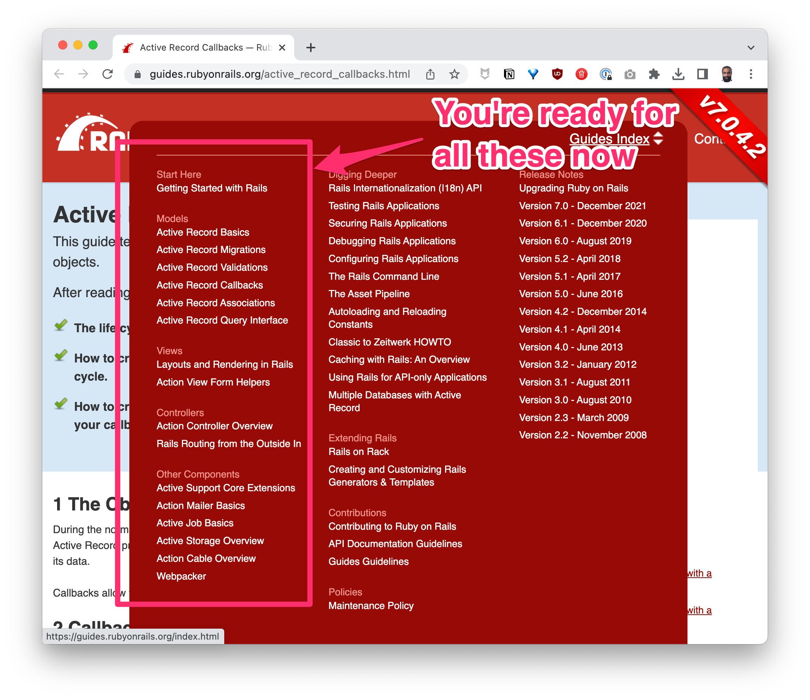

# Sprint 1: Assignments
- Rails: Rock, Paper, Scissors 🪨🧻✂️
  - [Learn](https://learn.firstdraft.com/lessons/119)
  - [GitHub](https://github.com/appdev-lessons/rails-rps)

- Route, Controller, Action, View (RCAV) Flowchart 🚏
  - [Learn](https://learn.firstdraft.com/lessons/120)
  - [GitHub](https://github.com/appdev-lessons/rcav-flowchart)

- Different Ruby styles 💎
  - [Learn](https://learn.firstdraft.com/lessons/116)
  - [GitHub](https://github.com/appdev-lessons/optional-syntaxes-in-ruby)

- Rails: Dice Roll 🎲
  - [Learn](https://learn.firstdraft.com/lessons/122)
  - [GitHub](https://github.com/appdev-lessons/rails-dice-dynamic-routes)

- Rails: Omnicalc 1 🧮
  - [Learn](https://learn.firstdraft.com/lessons/123)
  - [GitHub](https://github.com/appdev-lessons/rails-omnicalc-1)

- Rails: Omnicalc 2 (debugging) 🪳
  - [Learn](https://learn.firstdraft.com/lessons/124)
  - [GitHub](https://github.com/appdev-lessons/rails-omnicalc-2)

- Rails Guides 🦮
```md
The [Rails Guides](https://guides.rubyonrails.org/) are a terrific resource, and you now have the vocabulary to understand the gist of most of them. Especially these:



For example, I feel like I learn something new every time I read the [Routing Guide](https://guides.rubyonrails.org/routing.html)

[ActiveRecord Callbacks](https://guides.rubyonrails.org/active_record_callbacks.html) is a core feature of ActiveRecord that we end up using in nearly every application for e.g. massaging a user input (say downcasing it) before validating it/saving it.

Peruse through the Rails Guides. You don't have to read them word for word, but get a sense of what's in there so that it rings a bell when you run into a use case. Think of questions to discuss next time (or post them on Ask).
```

- Contact Book: Our very first database 📒
  - [Learn](https://learn.firstdraft.com/lessons/130)
  - [GitHub](https://github.com/appdev-lessons/contact-book-first-database)

SQL (optional)
Active Record does SQL well & on our behalf, basic SQL is easy enough, this is informational at this point:

- (Optional) SQL for Beginners 🧐 📚
```md
GoRails recently released a [SQL for Beginners Series](https://gorails.com/series/sql-for-beginners) of video walkthroughs. Even though we'll mostly be using ActiveRecord as our ORM (object-relational mapping) to translate Ruby code to SQL, knowing some basic SQL will serve you throughout your career. I recommend working through these when you have time.
```

- (Optional) Learn SQL Games 🎯
```md
Want some fun practice on querying database records with SQL?

Then try out these fun games:

- [SQLZOO 🐘](https://sqlzoo.net/)
- [SQL Island 🏝️](https://sql-island.informatik.uni-kl.de/)
- [The SQL Murder Mystery 🕵️](https://mystery.knightlab.com/)
```

- [(Optional) SQL for the weary 😰](https://gvwilson.github.io/sql-tutorial/)
- (Optional) Top 50 SQL Interview Questions 💪
```md
Looking to refine your SQL skills and prep for that big interview? Here are the [top 50 SQL questions to crack the coding interview](https://leetcode.com/studyplan/top-sql-50/).
```
