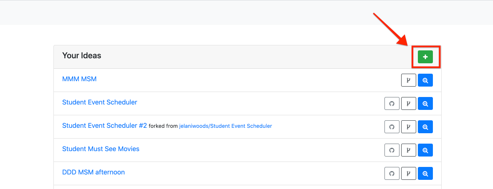
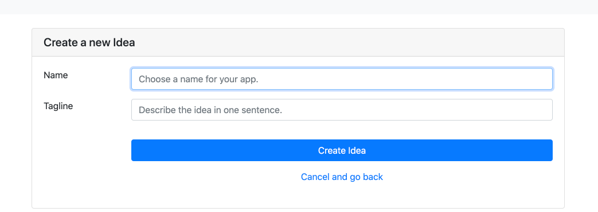
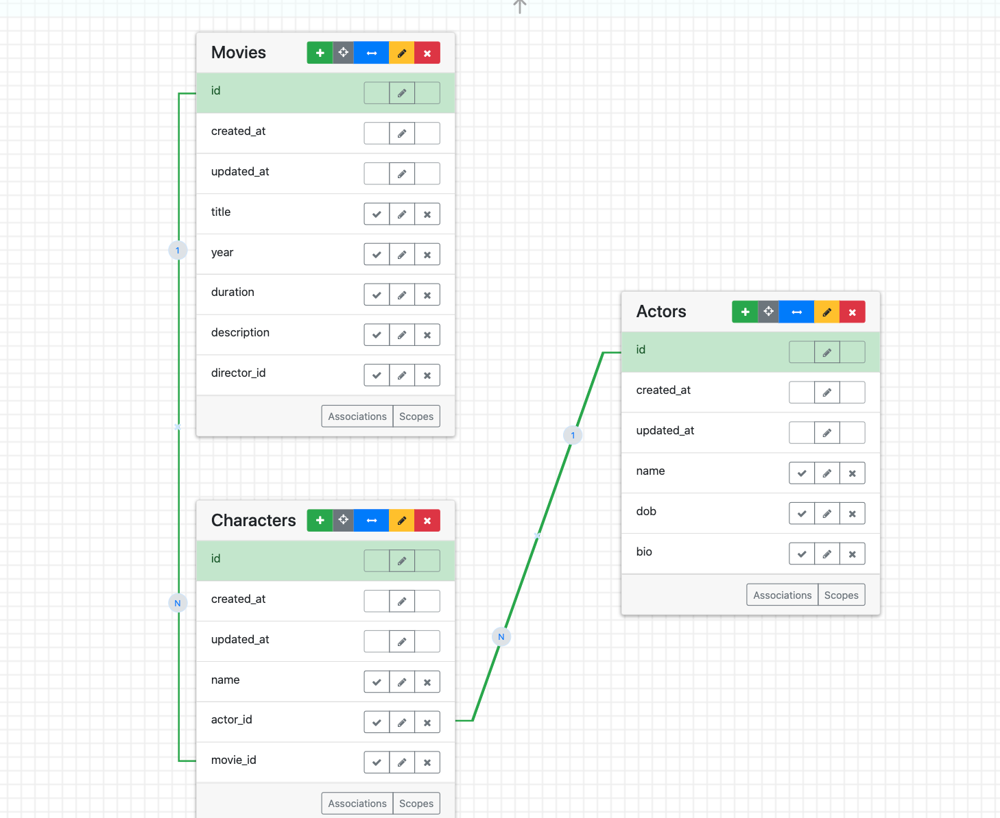

# Week 2 Meetings
## Photogram 📸
- **Points**: 2
- **Submitting**: a text entry box or a file upload
- [Slides](https://github.com/DPI-WE/sdf-record-keeping)
- [Video](https://youtu.be/XqHnkDFao4s)
```md
Let's figure out the data model behind [an app called Photogram](https://pg-ajax-1.matchthetarget.com/).

Sign in with one of the existing users (All of their passwords are "password"):
  - alice@example.com
  - bob@example.com
  - carol@example.com
  - doug@example.com
  - ellen@example.com

Imagine that it's a mockup, and that you've been hired to build an app like that. (Don't come up with additional features or improvements; our job is to build it as it is now.)
What tables and columns will you need? Try to produce a complete list of tables and columns.
I find it helpful to use paper or a spreadsheet to actually draw out all my tables, columns, and try entering in rows to make sure I can record everything necessary for all screens and possible user actions that I can see in the mockup.

**Assignment**: Please submit a screenshot of the entity relationship diagram (ERD) using the [Entity Relationship Diagram (ERD) tool](https://ideas.firstdraft.com)
```

## Entity Relationship Diagram (ERD) tool 📊
```md
Checkout this tool we'll use to create entity relationship diagrams (ERDs) for our projects: https://ideas.firstdraft.com

## Getting started
Once you login you can create a new "Idea" by clicking the green plus icon near the top right of the screen.



Once you click that you should see a form where you can choose a name for your project.



Once, you've named it click "create" to proceed.

## Adding tables
You can add tables to the canvas by clicking on and dragging the green plus icon onto the canvas.

If the table represents a "user" or someone who will sign up and sign in, check the "User Accounts?" checkbox to get a email and password column.


## Adding columns
You can add columns to a table by clicking the green plus icon in the header of a table.

A dialogue should popup and prompt you to choose a column name. You're also required to choose a data type for the column.


## Editing columns
If you made a mistake selecting a column's data type or if want to rename that column you can click on the pencil icon next to the column, and the same form will popup and allow to make changes.


## Direct associations
To draw a direct association line between two tables and establish a one-to-many relationship, one table needs to have a foreign key column.

This foregin key column must be an Integer type.

Once you have your two tables created with the foreign key column click and drag the id column of the table and drop it onto the foreign key column in the other table.

If everything was successful, a dialogue will popup and the first two questions will prompt you to choose a name for each side of the association.


## Indirect associations
In order to draw the dashed indirect association line between two tables and establish a many-to-many relationship, you need to first draw the two direct associations between each table and the connecting join table.



Once those direct associations have been built, click and drag the blue double-headed arrow from one of the two tables in the many-to-many and drop it anywhere on the other table.

A dialogue should pop up and ask you to pick which two associations make up the larger many-to-many relationship that you're trying to draw.

Once you select the two associations, you can choose more specific names for each side of the many-to-many.


```

## Introduction to Bootstrap 🥾
- [Learn](https://learn.firstdraft.com/lessons/139)
- [GitHub](https://github.com/appdev-lessons/intro-to-bootstrap)
- [Video](https://youtu.be/NW2W7rz4sY8)

## Reading: Design Resources 🧑‍🎨
- [Learn](https://learn.firstdraft.com/lessons/143-design-resources)
- [GitHub](https://github.com/appdev-lessons/design-resources)
```md
If you find that you're having fun learning about HTML & CSS and would like to learn more about front-end/design, here is a list of optional readings and resources.

I recommend these two readings, at a minimum:

- [Butterick’s Typography In Ten Minutes](http://practicaltypography.com/typography-in-ten-minutes.html) — the whole book is short and worth a read if you like the 10 minute intro.
- [7 Rules for Creating Gorgeous UI](https://learnui.design/blog/7-rules-for-creating-gorgeous-ui-part-1.html) - and [part 2](https://learnui.design/blog/7-rules-for-creating-gorgeous-ui-part-2.html#rule-4-learn-the-methods-of-overlaying-text-on-images)
```

## Todo List 📝
- [Slides](https://github.com/DPI-WE/sdf-record-keeping)
- [Video](https://youtu.be/XqHnkDFao4s)
```md
Let's figure out the data model behind [this Todo List app](https://ujs-practice-1.matchthetarget.com/)

- Sign up for an account, click around the app, and acquaint yourself with it.
- You can also sign in with the existing user "alice@example.com", password "password".
- Imagine that it's a mockup, and that you've been hired to build an app like that. (Don't come up with additional features or improvements; our job is to build it as it is now.)
- What tables and columns will you need? Try to produce a complete list of tables and columns.
- I find it helpful to use paper or a spreadsheet to actually draw out all my tables, columns, and try entering in rows to make sure I can record everything necessary for all screens and possible user actions that I can see in the mockup.
Slides

**Assignment**: Please submit a screenshot of the entity relationship diagram (ERD) using the Entity Relationship Diagram (ERD) tool
```
