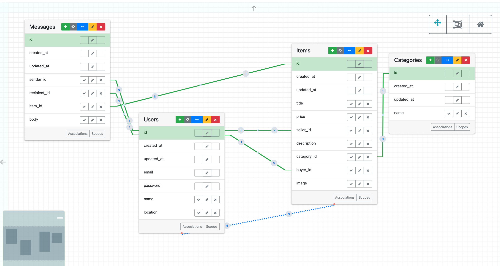

# Week 4 Meetings

## Pull Requests and Code Review 📝🔧🔍
- [Slides](https://github.com/DPI-WE/sdf-code-review)
- [Video](https://youtu.be/QyI378QaCOA)
- [Pull Requests and Code Review 📝🔧🔍](./github-workflow.md#pull-requests-and-code-review-📝🔧🔍)
- [Fun Fact 🤪](./github-workflow.md#fun-fact-🤪)

## Offer Right 🤝
- [Slides](https://github.com/DPI-WE/sdf-record-keeping)
- [Video](https://youtu.be/Fltvtv9Mltk)
```md
Explore this target application: [Offer Right](https://offer-right.matchthetarget.com/).

It's a simplified version of the real [Offer Up](https://offerup.com/) — a two-sided market. Users can:

- post items to sell
- browse items to purchase
- chat with sellers to make offers
- sellers can mark items as sold once satisfied
- buyers and sellers coordinate meeting up on their own

Sign up for a new account or use our standard (alice/bob/carol@example.com with password of password). Explore and experiment with the features. I suggest taking notes on the following:

- Identify all of the screens in the app.
- On each screen:
  - What information can you see?
  - What actions can you take? Usually, this means: "what links and buttons can you click?"
  - For each action:
    - What screen do you end up on after you take it?
    - What information was created/read/updated/deleted along the way?

Keeping the notes you took above in mind: design a data model that can support all user actions that you observe in app. I.e., a complete listing of tables and columns.

Remember that it's usually helpful to create your tables on paper or in a spreadsheet and entering some sample records to make sure you can record everything you're trying to record, before attempting to create the compact Entity Relationship Diagram (ERD).

**Assignment**: Please submit a screenshot of the entity relationship diagram (ERD) using the first draft Entity Relationship Diagram (ERD) tool
```

### Offer Right (example solution) 🛒 💡
```md
Here is an example solution for the Offer Right assignment:

## Example Solution
There is definitely more than one data model that will work! But here is one example solution. Take a look, compare it to your own, and ask questions if anything is not clear!

ERD ([Entity–relationship model](https://en.wikipedia.org/wiki/Entity%E2%80%93relationship_model))




```

## Link in Bio 🕴️and First Project 🚀
- [Video](https://youtu.be/6UXWxOx7Q6s)
```md
We'll do another pull request exercise with [Link in Bio 🕴️](./github-workflow.md#link-in-bio-🕴️)  and [First Project 🚀](./github-workflow.md#first-project-🚀).
```
