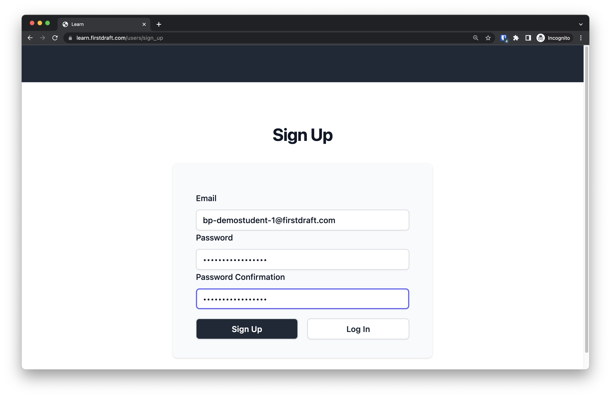

<!-- TODO: anything else needed here? eg attendance, schedule, expectations, etc. -->
# Onboarding

**Requirements**:
- must complete all of these requirements
- must move through requirements in sequential order

## Welcome!
- **Points**: 0
- **Requirements**: mark as done
- **Due**: end of week 1
<!-- TODO: add welcome video -->


<!-- TODO: convert to learn lessson? -->
## Join Discord chat 💬
- **Points**: 0
- **Requirements**: mark as done
- **Due**: end of week 1
```md
Join the Discord server to chat with your classmates and instructors. (link on home page)

Discord Server Rules

1. Be kind
2. Use the same name (first and last) used in canvas in your server profile
3. Use a workplace appropriate profile image

<!-- TODO: add examples? -->
```
<!-- TODO: introduce yourself on discord? -->

## Setup your email 📧
- **Points**: 2
- **Requirements**: submit the assignment
- **Due**: end of week 1
- [Learn](https://learn.firstdraft.com/lessons/421-setup-your-email)
- [GitHub](https://github.com/DPI-WE/setup-your-email)

### Follow up email
- **Points**: 2
- **Requirements**: submit the assignment
- **Due**: end of week 1
```md
Send an email from your student account to a TA with the subject line: “Setup my email”. This will confirm that you have successfully set up your email client.
```

## Setup your calendar 📅
- **Points**: 2
- **Requirements**: submit the assignment
- **Due**: end of week 1
- [Learn](https://learn.firstdraft.com/lessons/422-setup-your-calendar)
- [GitHub](https://github.com/DPI-WE/setup-your-calendar)

### Follow up calendar invite
- **Points**: 2
- **Requirements**: submit the assignment
- **Due**: end of week 1
```md
Create a New Recurring Meeting and add a TA
```

<!-- TODO: check if there is an updated lesson for this -->
## Learn: create an account ✏️
- **Points**: 0
- **Requirements**: mark as done
- **Due**: end of week 1
```md
We will be using a platform called Learn to host project notes, embedded quizzes, and to launch GitHub projects.

Visit https://learn.firstdraft.com/users/sign_up to sign up for an account before proceeding.

You can use whichever email address you prefer for the sign up step.



This will bring you to an empty "Lessons" page, which will begin to populate as you move through the course.


In the future, to get back the list of lessons you've begun, click on the "firstdraft" logo at the top of a Lesson page:


You can close this browser tab when you've completed the sign up.
```

<!-- Paired with Learn -->
### Learn: Setup References (forking, 💻 coding, 📊 grading, etc.)
```md
## Forking, Setting up a Codespace, and using `rake grade`
- [Learn](https://learn.firstdraft.com/lessons/46)
- [GitHub](https://github.com/appdev-lessons/project-setup)

## Notes about `rake grade`
- [Learn](https://learn.firstdraft.com/lessons/125)
- [GitHub](https://github.com/appdev-lessons/using-rake-grade)
```

## Setup Your Internal Profile
- **Points**: 2
- **Requirements**: submit
- **Due**: end of week 1
- [Learn](https://learn.firstdraft.com/lessons/423-setup-your-internal-profile)
- [GitHub](https://github.com/DPI-WE/setup-your-internal-profile)

### Submit Your Snapshot URL
- **Points**: 2
- **Requirements**: submit
- **Due**: end of week 1

## Daily Stand-ups 🌟 <!-- Discuss more on agile/scrum ceremonies? retro on fridays, etc. -->
- **Points**: 2
<!-- TODO: convert to Learn lesson for scoring -->
- **Requirements**: score at least 2/2
- **Due**: end of week 1
```md
Daily "stand-ups" are a very common practice on "agile" development teams.
A quick meeting — 10 minutes or less — for the entire team to check in with each other. It's called "stand-up" because it's supposed to be short enough to stand for the entire thing.
You go in a circle and briefly describe three things:
1) what did you work on yesterday?
2) what are you working on today?
3) is anything blocking you?
You may also "pass" if what you did is completely irrelevant to the team (e.g. I took my dog to the vet).
The key part is #3 — to find ways to get unblocked. It may be finding people with expertise in what you're struggling with or letting other people know that they're blocking you.
It might feel a little scary to share what you're working on. Maybe you're behind and feel self-conscious? Maybe you're ahead and feel self-conscious?
It's natural and understandable, but we need to overcome this reflex.
We're all on a team together, and on a healthy team, people are transparent with each other. There's no judgment, only support.
Less than 1 minute per person.
What did you work on yesterday?
It's okay to say "I pass" if e.g. you were at a doctor's appt or worked on something not relevant to the team.
What are you planning to work on today?
Try to be specific; not just "Ruby stuff yesterday, more Ruby stuff today". Otherwise you might as well just pass.
Any blockers or "Aha!" moments?
It's okay to say "No blockers". Since we're mostly learning and not yet working on teams, you probably won't have blockers, per se. 
However, instead: try to think of any "Aha!" moments that you had yesterday and share those.
We'll be doing stand-ups every day at 9:15

Remember to spend some time preparing for stand ups by writing down your 3 things.
```

### Daily Stand-ups 🌟
```md
What are you supposed to do during stand-ups?
```

## Overview 😀
- [Slides](https://github.com/DPI-WE/sdf-overview)
- [Video](https://youtu.be/zKXbvdpGjnE)
```md
Thank you embarking on this journey with us. This lesson provides an overview of the 12-week software development foundations course.
```
