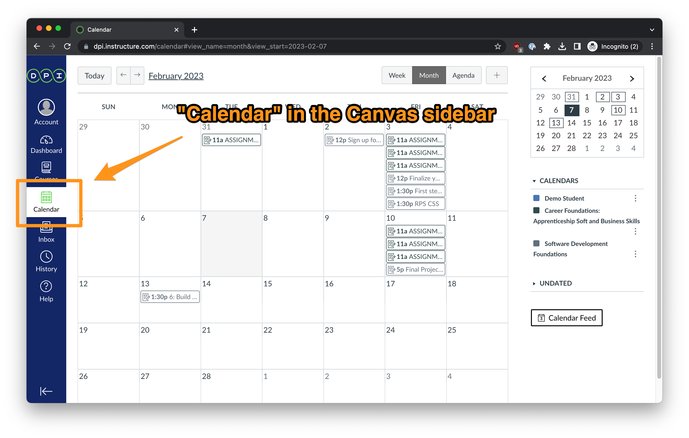
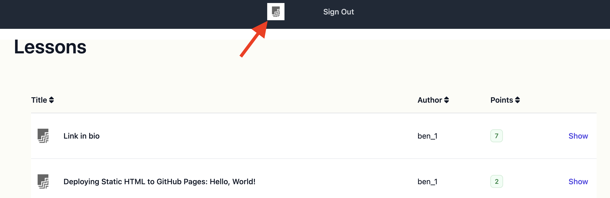

# Getting Started

**Requirements**:
- must complete all items in section

## Overview: Getting Started
```md
In this module you will learn about several resources that represent how software development teams work, communicate, and share what they do.

### Objectives
After successful completion of this module, you will learn how to:

- Become familiar with typical software development team communication tools
- Share knowledge
- Engage in active communication
- Perform research
- Know when and how to ask for help

### Activities
- Join a Discord group
- Set up a calendar feed
- Select a password manager
- Ask a generative AI assistant
- Sign up for a cloud code storage account
- Document your learning notes

Explore how the course functions, navigate effectively, and make the most of the abundant resources available.

[Orientation Video](https://youtu.be/wBkfbvQ5jiM)
```

## Course Syllabus
```md
- **Points**: 0
- **Requirements**: mark as done
- **Due**: none/rolling; to be completed before application deadline

### Introduction to Software Development Foundations 
This course is a self-paced, project-based introduction to object-oriented programming, web app development, and career skills preparation.  There are no formal prerequisites.

The curriculum includes state-of-the-art educational tools that includes access to an experienced and friendly instructional staff.  Learning materials consist of interactive lessons, helpful examples, knowledge checks, fun projects, and AI-powered virtual assistance.  Total completion time is approximately 126 hours.

Maximum Canvas points goal: 227 points for the course.

### Skills Gained
- HTML, CSS
- Technical writing
- Cloud Deployment
- Version control
- Data structures
- Object-oriented programming and design
- HTTP Requests, REST APIs
- Sinatra Web App Framework

### Syllabus

#### Getting Started
- Familiarize typical software dev team communication tools
- Sharing knowledge
- Active communication
- Research
- When to ask for help

#### Technical Setup References
- Cloud-based development tools include VSCode
- Introduction to GitHub

#### Hello, World!
- Introduction to deployment
- Developing a static web site
- Deploying a static web site

#### HTML & CSS
- Fundamental HTML5 syntax
- Comprehensive CSS styling
- Deploying a user-friendly static web site

#### HTML & CSS Reference
- How to research HTML and CSS skills
- Introduction to a cloud-based development environment
- Understanding high-quality web design

#### Intro to Ruby
- Understand variables and data types
- Identify and implement control structures
- Understand and create classes, objects, methods, object-oriented design

#### Additional Ruby Practice
- Continuous learning references for several levels of complexity
- Summary learning references
- Researching programming language APIs

#### Ruby Gym
- Employ analytical skills to solve algorithms of moderate complexity
- Developing solutions with numerical algorithms
- Developing algorithms for string manipulation

<!-- TODO: add command line interface project -->

### HTTP & APIs
- Interfacing with external APIs
- Acquire and secure credentials
- Comprehend and utilize the JSON data-interchange format

### Web Apps with Sinatra
- Develop a web app using a lightweight framework
- Employ web servers to deliver HTML presentation
- Deploy a web app to the Internet

### Web Apps with Sinatra & OpenAI API
- Implement external APIs in apps
- Create requests and retrieve responses
- Construct HTML presentation

### Mini Project
- Brainstorming ideas and conducting feasibility studies
- Implementing business logic on the server-side
- Design user-friendly HTML presentation

### Career Exploration
- Understanding computer and internet fundamentals
- Exploration of career pathways
- Reflecting upon developer testimonials

### Career Portfolio
- Creating an effective elevator speech
- Writing and designing a resume
- Creating successful correspondence
```

- [Orientation Video 👋](https://youtu.be/wBkfbvQ5jiM)
- Join Discord chat 💬
```md
# Join Discord
To join the Discord server to chat with your classmates and instructors start by clicking [here](https://discord.gg/2KGrR2NbtH) to make a join request.

Then, please wait up to 24 hours to added to the main server channel. While you wait to be added, you can still submit your Discord User Id to this assignment and continue with the rest of this module.

## Discord Server Rules

1. Be kind
2. Please use your real name in discord as it appears in canvas. It’s ok to use a first initial for your last name.
3. Use a workplace appropriate profile image

## Introduce yourself
Find the introduce-yourself channel, follow the channel suggestions on what to put in your introduction, and add this to your About Me profile in Discord.

## Submit your Discord User Id to this assignment
You can access your Discord User Id by following the steps below:

1. Go to your Discord “User Settings” by clicking on the wheel icon next your profile name at the bottom left side of your Discord view. 


2. In "User Settings", select the “Advanced” menu option on the left-hand side and ensure Developer Mode is enabled.


3. In "User Settings", select the “My Account” menu option on the left-hand side. Click the 3 dots next to your name and select “Copy User Id”.


4. Submit this user ID as part of your assignment.
```
- Peer-to-peer Learning Culture👐🏽👐🏿👐🏻
```md
Welcome to our culture of peer-to-peer learning! 🌟 We're excited to embark on this learning journey with you - one where we all grow together, not just as software developers but as invaluable contributors to each other's learning process. 

Here's why this experience is going to be rewarding:

- **Teach to learn**: Did you know that we remember 90% of what we teach? Compare that to the 5-10% from just reading or listening! When you teach, you're not just helping others; you're helping yourself cement this knowledge. So, whenever you're able, lend a hand in teaching; it benefits the whole community!

- **Build communication skills**: Tech industry isn't all about coding alone; it's about sharing and explaining problems and ideas. When learning with others, you’ll sharpen your skills in articulating complex issues and collaborating on solutions—just what the real world demands.

- **Relationships motivate**: Building relationships here means more than just better learning; it’s about supporting each other, increasing our motivation, and accountability. This isn't just school; this is your tribe.

- **Help even if you’re not sure**: Don’t know if you can help your peer? We encourage you to try! Sometimes, finding the solution with your peers, even when none of you knows it at the outset, makes learning exciting and less lonely. If you stay stuck, just reach out to an instructor for help.

- **The goal is comprehension**: Got an answer from a peer? Great! But don’t stop there. Ask “Why?” and “How?” until you truly get it. Challenge every answer for your own clarity!

If you haven’t already, pop over to the Discord "Introduce-yourself" channel and let’s get the introductions rolling. Don't forget to also say hello 👋 to your peers who've already introduced themselves. This is more than just saying “Hi”; it’s about building the first bridge with your peers and maybe, friends for life (as we’ve often seen with DPI graduates 🙂)! We’ll use Discord to grow our peer learning community, so be sure to stay signed in and active on Discord as much as possible.

## Agreement
I understand that my participation in Discovery Partners Institute’s (DPI) “Introduction to Software Development Foundations” course involves a collaborative learning approach. In this spirit, I agree to the following:

- **Assisting Peers**: My Discord display name or username may be shared with fellow students who are experiencing challenges specifically related to the course content, in situations where I may be able to provide assistance. This process is designed to foster a supportive, interactive learning environment, and I am willing to contribute to the best of my ability.

- **Receiving Assistance**: Similarly, I consent to have my Discord display name and Discord username shared with selected students whom DPI identifies as potentially helpful to me in addressing my own learning challenges within the course. This sharing aims to facilitate assistance and guidance from peers who may have insights or strategies to offer.

## What to submit for this assignment
Type your first name, middle name (if any), and last name in the Text Entry box and submit to acknowledge your acceptance of these terms and conditions, and you empower us to make your learning experience richer and more connected.
```
- Course introduction video 📹
```md
Please watch [this ~50 minute video which introduces the course](https://share.descript.com/view/vaZyM1idzLJ).

This is a recording of the first lecture from a recent real-time offering of the course.

[Here are the slides](https://firstdraft.slides.com/raghubetina/appdev-01-course-overview?token=QqVspuOF) that Raghu is going through in the video; it will be helpful to have them open in a tab.
(Note: you DO NOT need to take the survey referenced in this video)

Please ask any questions that occur to you while you're watching the video in Discord!
```
- Setup your calendar 🗓️
```md
Canvas has a really neat feature: the Calendar.

It will aggregate events, assignments, etc, from all of the courses you are enrolled in:



It also provides a calendar feed URL, which you can subscribe to in your calendar of choice (I use apple calendar):


This is a good opportunity to practice using your calendar, whether it's Apple Calendar, Google Calendar, Outlook or any other.

Please add subscribe to the canvas calendar feed and submit the name of your preferred calendar app.

Enter the name of your calendar application you're using to subscribe to the canvas calendar.
```
- Setup a Password Manager 🔐
```md
I've noticed a lot of students use pen/paper or a text file on their computer to store passwords. 

[Password Best Practices](https://www.it.ucsb.edu/secure-compute-research-environment-user-guide/password-best-practices).

Please sign up for a password manager and enter the url of the one you've chosen. I personally use [Bitwarden](https://bitwarden.com/). (free for personal use and syncs desktop/mobile). There are many out there. Do your research. 🧑‍🔬🔬
```
- Asking Questions ❓
```md
## Questions ❓
- This course is question-driven.
- We need you to ask questions.
- Speak up whenever you feel like it, raise your hand in the classroom, post a question to Discord or [ask.firstdraft.com](http://ask.firstdraft.com/).
- If you’re not sure whether it’s relevant to everyone, message a TA or Instructor and ask them; they’ll decide and escalate.
- our rule: **You’re only allowed to get stuck for 15 minutes before asking a question.**
- Post your questions on Discord or ask.firstdraft.comLinks to an external site.
- The course is organized according to the the 🔐 lock-before-key principle; until someone asks the question, I won’t provide the info needed to solve an exercise.
- Most of your programming work will be done at your own pace
- Learning occurs through asking questions
- Remember the 15 Minute Rule
- You’re only allowed to get stuck for 15 minutes before you ask a question.
- Don’t spin your wheels for longer than that!
- When you have a question, instead of raising your hand or finding one of us, we want you to first type up your question on [ask.firstdraft.com](http://ask.firstdraft.com/) or Discord.

## Why? 🤨
- Writing out what you’re struggling with will often help you solve it yourself
- Writing well is an essential component of succeeding as a software engineer (remote work, stack overflow, GitHub etc.)

## Asking Questions 🙋
- State the problem you’re working on
- What is your code doing right now?
- What do you want it to be doing instead?
- Copy-paste the snippet(s) of code that you think are relevant.
- Describe what you’ve tried so far to resolve.

## Code Snippets 👨‍💻
Please use [markdown code snippets](https://www.freecodecamp.org/news/how-to-format-code-in-markdown/) when sharing pieces of code

`<h1>Hello, world!</h1>`

## Answering Questions 🤓
- Keep an eye on [ask.firstdraft.com](http://ask.firstdraft.com/) and try to help your classmates
- After you solve your problem, please update your question with the answer

## Participation 🏆
- "Ask participation" is a component of your overall evaluation/”grade”
- We keep track of:
  1. Number of questions you’ve asked (this is the most important metric)
  2. Number of other peoples’ questions you’ve read (2nd most important metric)
  3. Number of other peoples’ questions you’ve answered

## In Review 📜
- Even though it’s weird to be asking & answering questions on a forum, please give it a try.
- Trust us, it greatly improves learning and retention to write first and then talk it through.

## Still not convinced?
- [Steve Jobs on 'asking for help'](https://www.youtube.com/watch?v=zkTf0LmDqKI)
```
  - Asking Questions ❓
  ```md
  How long are you allowed to be stuck before asking a question?
  ```
  - Asking Questions: Code Snippets 🧑‍💻
  ```md
  - What are code snippets?
  - How do they work?  
  - Please provide an example of a markdown code snippet.
  ```
- Ask: create an account 🛠️
```md
- Sign up for an Ask account at ask.firstdraft.com.
- Ask questions and experiment with requesting responses from the GP-TA.
```
- Learn: create an account 📚🔐
```md
We will be using a platform called Learn to host project notes, embedded quizzes, and to launch GitHub projects.

Visit https://learn.firstdraft.com/users/sign_up to sign up for an account before proceeding.

You can use whichever email address you prefer for the sign up step.


This will bring you to an empty "Lessons" page, which will begin to populate as you move through the course.


In the future, to get back the list of lessons you've begun, click on the "firstdraft" logo at the top of a Lesson page:



You can close this browser tab when you've completed the sign up.
```
- Sign up for GitHub 🖥️📝
```md
Please sign up for [GitHub](https://github.com/join) and share your profile page. It should be something like this `github.com/<username>`. Please set a profile image and display name using your first and last name so it's easy to tag you. Your GitHub profile is like a software engineering resume. It's important for employers, clients, teammates, etc. to know it's you. I also recommend keeping only 1 GitHub account so your contribution graph is full of green. You can create organizations to separate your repositories. 


This is mine. https://github.com/heratyian

Here are the steps to update your 'display name':


```
- Setup your TIL blog 📝👨‍💻
```md
Keeping a learning journal is extremely valuable for software developers, for many reasons:

- Writing about what you’re doing helps clarify and internalize it.
- The post serves as documentation for the code, for teammates and your future self.
- When you inevitably have to do the same task again six months or two years later, you’ve written a cheat sheet for yourself.
- It looks great to prospective employers, demonstrating both writing and technical ability, among other things.

We call these "TIL blogs" or "TILs" — short for "Today I Learned". It isn't meant to be a blog where you're publishing brand new ideas that no one has ever thought of before — instead, they're just notes to your future self. (But I do learn about a lot of new stuff by reading students' TIL blogs, even after all these years.)

Here is [a learning journal](https://jelani.dev/) from a past student who went on to become an instructor himself, as a great example.

We're going to use [dev.to](https://dev.to/) for our blogs, for now. (In the future you can consider building your own blog — that would be a good exercise.)

[Sign up for a dev.to account](https://dev.to/enter) — I recommend signing in with GitHub so that you don't have to make up yet another password.

**Submit the URL of your learning journal**. It will look something like `https://dev.to/demostudent18`

Start jotting down notes in your blog. You can save posts as drafts if you're not ready to share them yet.

A great source of TIL blog posts are answers to questions you've asked and other discussions (your own or others). To really cement what you learned, re-write the answer to your question or discussion as a TIL post.

Keep track of everyone's TIL blogs on [news.dpi.dev](https://news.dpi.dev/). Someone else might have already written the answer to your question!
```